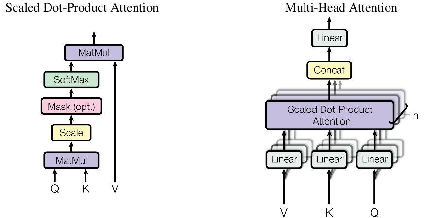
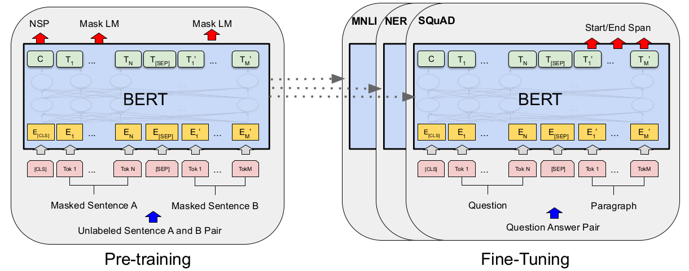
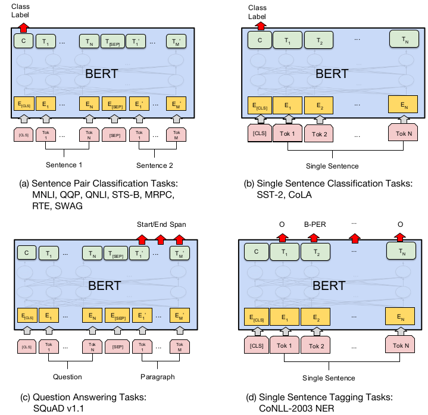
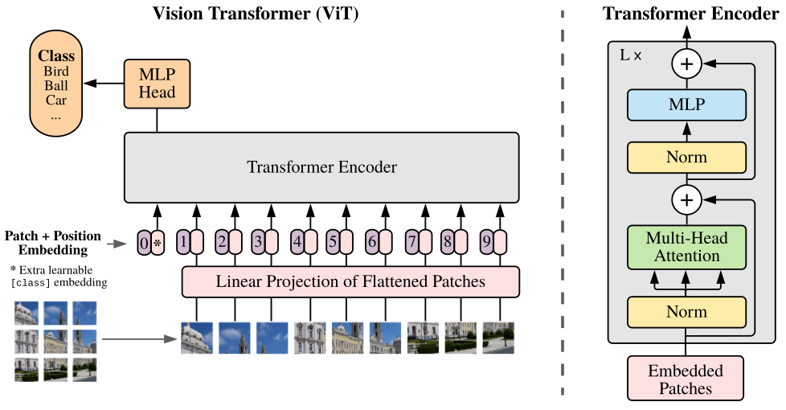

# Transformer

万物皆可Transformer

* [**Transformer**](#attentionisallyouneed)
* [BERT](#bert)
* [DETR](#detr)
* [DeformableDETR](#deformabledetr)
* [iGPT](#igpt)
* [VIT](#vit)
* [IPT](#ipt)
* [SETR](#setr)
* [TransGAN](#transgan)
* [TransReID](#transreid)
* [Informer](#informer)

------
## AttentionIsAllYouNeed
[Transformer](https://arxiv.org/abs/1706.03762)
抛弃了传统的CNN和RNN, 提出了完全基于attention机制的Transformer, 
实现seq-to-seq任务.

### Model Architecture

* encoder + decoder
* encoder将一个符号表示的输入序列x=(x_1, ..., x_n)映射为一个连续表示序列
z=(z_1, ... , z_n). 然后decoder生成符号的输出序列y=(y_1, ..., y_m), 
每次一个元素. 在生成下一个步骤时, 使用前面的输出作为额外的输入.
* encoder和decoder都是堆叠多个identical layers.(Nx)
* 每个identical layers包含两(三)个sub-layers(
(Masked)multi-head self-attention mechanism & 
position-wise fully connected feed-forward network).
* 每个sub-layers后接LayerNorm(x + Sublayer(x))
* 对于decoder的来说, 我们是不能看到未来的信息的, 
所以对于decoder的输入, 我们只能计算它和它之前输入的信息的相似度.
因此需要做Mask.
* multi-head self-attention的三种使用方式:
    * "encoder-decoder attention" layers中: K=V, 是encoder的输出.
    Q, 是上一层decoder的输出
    * encoder的self-attention layers中: Q=K=V, 即上一层encoder的输出
    * decoder的self-attention layers中: 为了防止信息的左向流动, 使用了
    masking out.

### Attention

* 
* 
* Q~nxdk, K~mxdk, V~mxdv, A~nxdv.
* Query, Key, Value的概念取自于信息检索系统. 
例如, 你有一个问题Q, 然后去搜索引擎里面搜索, 
搜索引擎里面有很多文章, 每个文章V有一个能代表其正文内容的标题K, 
然后搜索引擎用你的问题Q和那些文章V的标题K进行一个匹配, 
得到相似度（QK ---> attention值）, 
然后你想用这些检索到的不同相关度的文章V来表示你的问题, 
就用这些相关度将检索的文章V做一个加权和, 那么你就得到了一个新的Q'. 
这个Q'融合了相关性强的文章V更多信息, 这就是注意力机制.
* Self-Attention是Attention的特殊形式(Q=K=V). 
在Sequence内部做Attention, 寻找sequence内部的联系. 
例如输入一个句子, 那么句子里的每个词都要和该句子中的所有词进行attention计算. 
目的是学习句子内部的词依赖关系, 捕获句子的内部结构.
* Multi-Head Attention是把Scaled Dot-Product Attention
做h次(参数不共享), 然后把输出Concat起来.

### Position-wise Feed-Forward Networks

* 相当于一个MLP

### Positional Encoding

* 相对位置: 位置p+k的向量可以表示成位置p的向量的线性变换, 
这提供了表达相对位置信息的可能性.
    * sin(α+β) = sinα cosβ + cosα sinβ
    * cos(α+β) = cosα cosβ − sinα sinβ
* 可以直接计算embedding而不需要训练, 减少了训练参数.
* 允许模型将position embedding扩展到超过了训练集中最长position.

### 优势
* 与CNN相比: 全局注意力机制
* 与RNN相比: 并行化

[返回顶部](#transformer)

------
## BERT
[BERT](https://www.aclweb.org/anthology/N19-1423.pdf)
使用Transformer刷新了多项NLP任务的记录, 引爆了NLP无监督预训练技术.

### Differences in pre-training model architectures

* bidirectional Transformer

### BERT input representation

* WordPiece嵌入, 具有 30,000 个词符的词汇表
* 每个序列的第一个标记始终是特殊分类标记（[CLS]), 
分类任务时使用.
* 使用特殊词符（[SEP]）将句子分开.
* 对于给定的词符, 其输入表示
input = token embedding + segment embedding + position embedding
* 为了应对不同的任务, 输入token sequence可以是
a single sentence 或 a pair of sentences.

* BERT的总体预训练和微调程序. 
* 除了输出层, 在预训练和微调中都使用相同的体系结构. 
* 相同的预训练模型参数用于初始化不同下游任务的模型. 
* 在微调期间, 所有参数都将进行微调. 
* [CLS]是在每个输入示例前添加的特殊符号, 而[SEP]是特殊的分隔符.
* Pre-training时, 使用无标签的数据进行训练. 
Fine-tuning时, 使用预训练得到的参数进行初始化, 
然后使用具体任务的带标签数据对参数进行微调.
* Pre-training, 
    * Masked LM(MLM, 完形填空), 
    随机的遮盖住一定比例的输入标记, 然后预测这些遮住的输入标记.
        * 训练数据生成器随机选择15%的token, 然后, 执行以下过程:
        * 80%: 用[MASK]标记替换单词; 例如, my dog is hairy → my dog is [MASK]
        * 10%: 用一个随机的单词替换该单词; 例如, my dog is hairy → my dog is apple
        * 10%: 保持单词不变. 例如, my dog is hairy → my dog is hairy. 
        这样做的目的是将表示偏向于实际观察到的单词.
    * Next Sentence Prediction(NSP), 
    输入这两个句子, 模型预测B是不是A的下一句.
* Fine-Tuning
* 将特定任务的输入和输出送入BERT, 然后端到端微调所有参数.
* 与预训练相比, 微调代价相对较小.

### 主要贡献
* 引入了Masked LM, 使用双向LM做模型预训练. 
* 为预训练引入了新目标NSP, 它可以学习句子与句子间的关系. 
* 进一步验证了更大的模型效果更好: 12 --> 24 层. 
* 为下游任务引入了很通用的求解框架, 不再为任务做模型定制. 

[返回顶部](#transformer)

------
## DETR
[DETR](https://arxiv.org/abs/2005.12872)
是基于Transformers的端到端目标检测, 没有NMS后处理步骤, 没有anchor, 
且效果堪比Faster RCNN.

### DETR Architecture

* Backbone:
    * input: 3xH0xW0
    * output: C=2048, H=H0/32, W = W0/32
* Transformer encoder:
    * 使用1x1卷积, 压缩通道个数 C-->d
    * 将2维数据拉伸成1维数据, d * HW
    * 添加固定位置编码
* Transformer decoder: 
    * 并行解码N个目标, 而不是每次预测输出序列中的一个元素.
    * object queries是学习到的位置编码.
    * object queries被decoder转换成output embedding.
* Prediction Heads(FFNs):
    * output embedding各自独立的被FFN解码成Cls+Box.
    * N大于真实的目标个数.
    * no object相当于"background"

### Object detection set prediction loss
* predicts & ground truth boxes间的唯一匹配问题.
* 
    * N > objects num, 使用∅(no object)补齐
    * 寻找最优分配
* 

作者发布了其pytorch[实现](https://github.com/facebookresearch/detr)

[返回顶部](#transformer)

------

## DeformableDETR
[Deformable DETR](https://arxiv.org/abs/2010.04159)

[返回顶部](#transformer)

------
## iGPT
[iGPT](https://cdn.openai.com/papers/Generative_Pretraining_from_Pixels_V2.pdf)
是一个完全无卷积和池化层的神经网络, 
引领了使用Transformer进行CV任务的浪潮.
其使用[GPT-2](https://cdn.openai.com/better-language-models/language_models_are_unsupervised_multitask_learners.pdf)
的网络结构进行图像特征建模, 
然后将特征直接应用到下游的分类任务中.
模型显现出对于2D图像特征的理解能力, 包括有效的个体和类别的理解. 
模型可以在没有人工指导情况下生成连续的图像样本, 
实现图像补全, 同时可以在多个分类数据集上实现先进的分类性能, 
并在ImageNet实现了非常接近最优秀无监督方法精度水平.

* 将图像resize成较低的分辨率, 然后reshape成1维序列. 
* pre-training, 二选一:
    * 预测下一个像素的像素值
    * 预测被mask像素的像素值
* 使用linear probes or fine-tuning评估模型.

[返回顶部](#transformer)

------
## VIT
[VIT](https://arxiv.org/abs/2010.11929)
将Transformer直接应用于图像块序列, 
在图像分类任务上达到了sota的效果.

### model overview

* 将图像分割成固定大小的patches; 
    * patches的大小固定, 个数可变
    * input image可以替换成CNN提取的feature maps
* 线性排序并添加位置编码; 
    * 与[BERT](#bert)类似, 在patches前面添加了一个
    learnable [class] embedding.
    * 可学习的位置编码, 学到了2D位置信息, 故无需使用2D位置编码
    * patches个数变多时, 学习到的位置编码要进行插值处理
* 标准的Transformer encoder;
    * 仅使用了Transformer中的encoder
* 使用MLP进行分类.
    * 在大的数据集上pre-training, 
    然后在目标数据集上fine-tuning

### Inspecting

* 图1显示了学习到的而没被的embedding filters
* 图2显示了学习到的Position embedding
* 图3显示了attention distance, 类似与CNN中的感受野

[返回顶部](#transformer)

------
## IPT
[ipt](https://arxiv.org/abs/2012.00364)

[返回顶部](#transformer)

------
## SETR
[SETR](https://arxiv.org/abs/2012.15840)

[返回顶部](#transformer)

------
## TransGAN
[TransGAN](https://arxiv.org/abs/2102.07074)

[返回顶部](#transformer)

------
## TransReID
[TransReID](https://arxiv.org/abs/2102.04378)

[返回顶部](#transformer)

------
## Informer
[Informer](https://arxiv.org/abs/2012.07436)

[返回顶部](#transformer)
