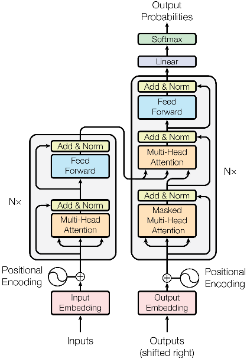

# Transformer

万物皆可Transformer

* [**Attention Is All You Need**](#attention is all you need)

------
## Attention Is All You Need
[Transformer](https://arxiv.org/abs/1706.03762)
抛弃了传统的CNN和RNN, 提出了完全基于attention机制的Transformer, 
实现seq-to-seq任务.

### Model Architecture

* encoder + decoder
* encoder将一个符号表示的输入序列x=(x_1, ..., x_n)映射为一个连续表示序列
z=(z_1, ... , z_n). 然后decoder生成符号的输出序列y=(y_1, ..., y_m), 
每次一个元素. 在生成下一个步骤时, 使用前面的输出作为额外的输入.
* encoder和decoder都是堆叠多个identical layers.(Nx)
* 每个identical layers包含两(三)个sub-layers(
(Masked)multi-head self-attention mechanism & 
position-wise fully connected feed-forward network).
* 每个sub-layers后接LayerNorm(x + Sublayer(x))
* 对于decoder的来说, 我们是不能看到未来的信息的, 
所以对于decoder的输入, 我们只能计算它和它之前输入的信息的相似度.
因此需要做Mask.
* multi-head self-attention的三种使用方式:
    * "encoder-decoder attention" layers中: K=V, 是encoder的输出.
    Q, 是上一层decoder的输出
    * encoder的self-attention layers中: Q=K=V, 即上一层encoder的输出
    * decoder的self-attention layers中: 为了防止信息的左向流动, 使用了
    masking out.

### Attention

* 
* 
* Q~n * dk, K~m * dk, V~m * dv, A~n * dv.
* Query, Key, Value的概念取自于信息检索系统. 
例如, 你有一个问题Q, 然后去搜索引擎里面搜索, 
搜索引擎里面有很多文章, 每个文章V有一个能代表其正文内容的标题K, 
然后搜索引擎用你的问题Q和那些文章V的标题K进行一个匹配, 
得到相似度（QK ---> attention值）, 
然后你想用这些检索到的不同相关度的文章V来表示你的问题, 
就用这些相关度将检索的文章V做一个加权和, 那么你就得到了一个新的Q'. 
这个Q'融合了相关性强的文章V更多信息, 这就是注意力机制.
* Self-Attention是Attention的特殊形式(Q=K=V). 
在Sequence内部做Attention, 寻找sequence内部的联系. 
例如输入一个句子, 那么句子里的每个词都要和该句子中的所有词进行attention计算. 
目的是学习句子内部的词依赖关系, 捕获句子的内部结构.
* Multi-Head Attention是把Scaled Dot-Product Attention
做h次(参数不共享), 然后把输出Concat起来.

### Position-wise Feed-Forward Networks

* 相当于一个MLP

### Positional Encoding

* 相对位置: 位置p+k的向量可以表示成位置p的向量的线性变换, 
这提供了表达相对位置信息的可能性.
    * sin(α+β) = sinα cosβ + cosα sinβ
    * cos(α+β) = cosα cosβ − sinα sinβ
* 可以直接计算embedding而不需要训练, 减少了训练参数.
* 允许模型将position embedding扩展到超过了训练集中最长position.

### 优势
* 与CNN相比: 全局注意力机制
* 与RNN相比: 并行化

[返回顶部](#transformer)